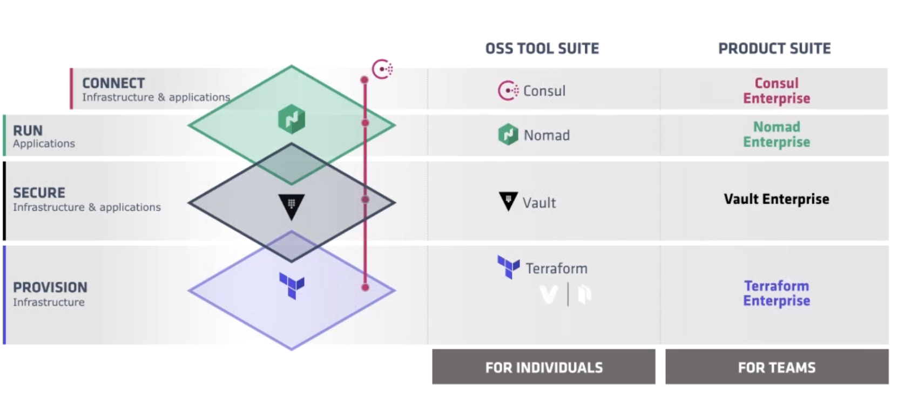
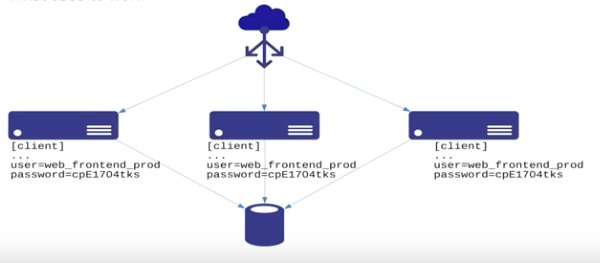
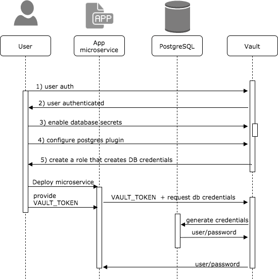

### Database Dynamic Secrets with Vault

---
@title[Agenda]
@snap[north-west]
Agenda
@snapend

@ul

- HashiCorp Overview
- Current Challenges
- Proposed Solution Review
- Demo

@ulend

---
@title[Portfolio Overview]
@snap[north-west]
Provision, Secure, Connect and run any infrastructure
@snapend

Note:

- The HashiCorp approach is to focus on end goal (applications) and workflow.
- Unix Philosophy that software should be simple, modular and composable. This approach prefers many smaller components with well defined scopes that can be used together

- Provision
  * vagrant - development tool
  * packer - creating images
  * Terraform  - create, change, and improve infrastructure
    * Infrastructure as code
    * codifies APIs into declarative configuration files
    * shared amongst team members
    * treated as code, edited, reviewed, and versioned.

- Secure - Vault
  * secret management (user/pass, db credentials, api tokens, TLS certs)
  * authenticate against trusted sources (LDAP, k8s, AD, cloud platforms
  * tightly controls access to secrets
  * Vault enables fine grained authorization of which users and applications are permitted access to secrets and keys.
  * supports dynamic secrets

- Run - Nomad
  * Cluster Manager and Scheduler
  * Run containerized or legacy applications in unified workflow
  * Disintermediate between App and OS.
  * Seperation of concerns between Dev and Ops

- Connect - Consul
  * service mesh solution providing  plane with
    * service discovery
    * configuration
    * segmentation functionality.
  * Each of these features can be used individually as needed, or they can be used together to build a full service mesh

---
@title[Current Challenges]
@snap[north-west]
Current Challenges
@snapend

@snap[south-west span-50]

@ul
- app tier shares DB credentials
- Rotating credentials is hard
- Credentials checked into VCS by mistake
- Desire to containerize and scale out app tier
- Increased risk surface as containers are caching secrets
@ulend
@snapend

@snap[east span-50]

@snapend

---
@title[Proposed Solution]
@snap[north-west]
Proposed Solution
@snapend

@snap[south-west span-45]
@ul
- Generate short-lived, per instance credentials using Vault
- A problem on a single instance only affects that instance
- Better visibility into potential compromises
@ulend
@snapend

@snap[east span-50]

@snapend

+++
@snap[north-west]
Vault Architecture
@snapend
@title[Vault Architecture]
@snap[south span-90]

[Documentation](https://www.vaultproject.io/docs/internals/architecture.html#glossary)

@snapend

<!-- ---
@title[Shamir's Secret Sharing]
#### Shamir's Secret Sharing

https://www.vaultproject.io/docs/internals/architecture.html -->

---
@title[Solution Overview]
@snap[north-west]
Solution Workflow
@snapend

@snap[west span-50]
@ul

- Configure Vault
- Create Vault Users
- Users generate instance credentials on demand
@snapend

@ulend
@snap[east span-50]

@snapend

+++?code=scripts/configure-vault.sh&lang=bash&color=#1E1F21&title=Configure Vault
@title[Configure Vault]

+++?code=scripts/create-users.sh&lang=bash&color=#1E1F21&title=Create Users
@title[Create Users]

+++?code=scripts/generate-credentials.sh&lang=bash&color=#1E1F21&title=Generate Credentials
@title[Generate Credentials]

+++?code=app/launch-app-containers.sh&lang=bash&color=#1E1F21&title=Configure App
@title[Configure App]
---
@title[Resources]
@snap[north-west]
Resources
@snapend

@ul

- [Slides](https://gitpitch.com/kecorbin/vault-demo)

- [Code](https://github.com/kecorbin/vault-demo)

- [Vault Documentation](https://www.vaultproject.io/docs/vs/index.html)

- [Database Secrets Engine](https://www.vaultproject.io/docs/secrets/databases/index.html)

- [Slide Credits](https://www.hashicorp.com/resources/securing-databases-with-dynamic-credentials-vault)

- [More Slide Credits (and a good blog)](https://dev.to/xfrarod/dynamically-securing-databases-using-hashicorp-vault-2kf)

- [Demo Inspiration](https://github.com/sethvargo/vault-demo)

@ulend
